# Bookstore with MERN stack
This project is a **Bookstore Application** built using the **MERN (MongoDB, Express.js, React.js, Node.js)** stack. The backend provides RESTful API endpoints for managing books, including functionalities like adding, retrieving, updating, and deleting book records. The frontend can later be built using React.js to consume this API and display the data to users.

View live site [here](https://natans-bookstore.vercel.app/)

## Frontend

The frontend of the Bookstore Application is built using React.js. It interacts with the backend API to provide a seamless user experience for managing books. The frontend allows users to view, add, update, and delete books through a user-friendly interface.

### Features

- **Responsive Design**: The application is designed to be responsive, ensuring a good user experience on both desktop and mobile devices.
- **Book List View**: Users can view all books in either a table or card format.
- **Add New Book**: Users can add new books using a form that submits data to the backend.
- **Edit Book Details**: Users can update book information directly from the list view.
- **Delete Book**: Users can remove books from the collection with a simple action.

### Installation
1. Navigate to the frontend directory:
    ```bash
    cd frontend
    ```

2. Install the required dependencies:
    ```bash
    npm install
    ```

3. Start the development server:
    ```bash
    npm start
    ```

   The app will run at `http://localhost:5173`.

### Home.jsx

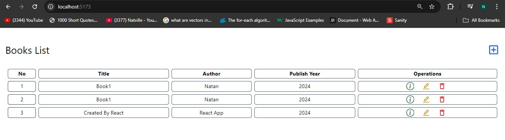

- **Purpose**: Serves as the main landing page of the application where users can view the list of books.
- **Features**:
  - Displays books in either a table or card format, based on user selection.
  - Provides a button to add a new book, linking to the `CreateBooks` page.
  - Utilizes the `Spinner` component to indicate loading status while fetching book data from the API.
  - Allows users to navigate to book details, edit, or delete pages via icons in the list.
- **Components Used**: `BooksTable`, `BooksCard`, `Spinner`, `BackButton`.

### CreateBooks.jsx

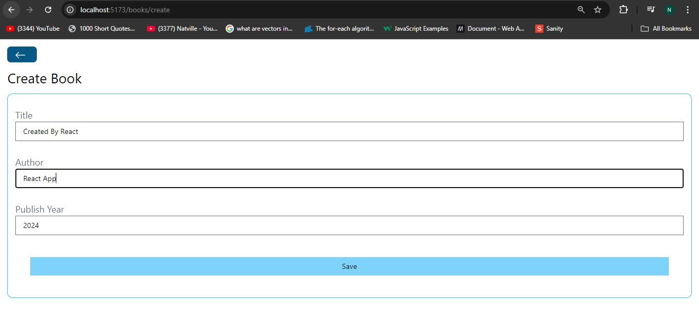

- **Purpose**: Allows users to add new books to the collection.
- **Features**:
  - Contains a form for entering book details such as title, author, and publish year.
  - Submits the form data to the backend API to create a new book record.
  - Provides a back button to return to the `Home` page.

### ShowBook.jsx

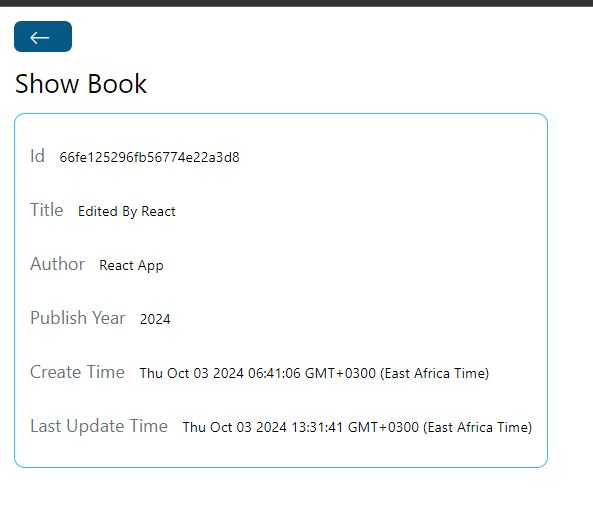

- **Purpose**: Displays detailed information about a specific book.
- **Features**:
  - Fetches and displays book details based on the book ID from the URL.
  - Provides options to edit or delete the book.
  - Includes a back button to navigate back to the `Home` page.

### EditBook.jsx

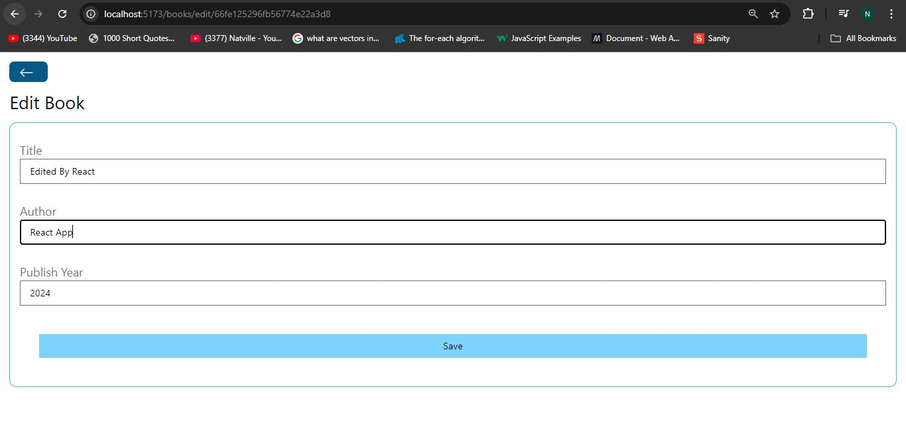

- **Purpose**: Allows users to edit the details of an existing book.
- **Features**:
  - Pre-fills a form with the current book details for editing.
  - Submits updated data to the backend API to modify the book record.
  - Includes a back button to return to the `Home` page.

### DeleteBook.jsx

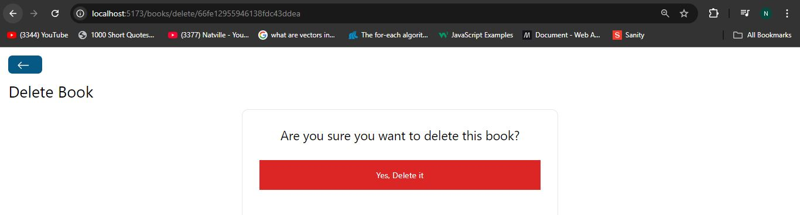

- **Purpose**: Handles the deletion of a book from the collection.
- **Features**:
  - Confirms the deletion action with the user.
  - Sends a request to the backend API to delete the book based on its ID.
  - Redirects back to the `Home` page after successful deletion.

- After delete:
   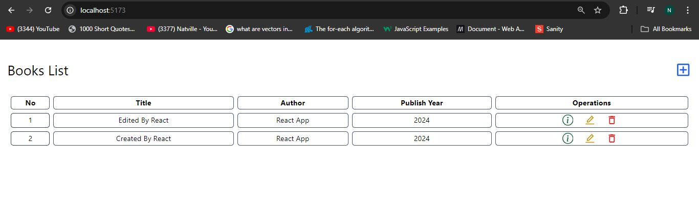


### API Integration

The frontend communicates with the backend API using Axios for HTTP requests. It handles CRUD operations for books, ensuring data is synchronized between the client and server. Start the server before the client.


## Backend
# Bookstore API

This is a simple RESTful API built using Express.js and MongoDB for managing a collection of books. It provides endpoints to create, read, update, and delete book records.

## Features

- Add new books
- Fetch all books
- Fetch a single book by ID
- Update book details
- Delete a book by ID

## Prerequisites

Make sure you have the following installed on your machine:

- [Node.js](https://nodejs.org/)
- [MongoDB](https://www.mongodb.com/) (local instance or [MongoDB Atlas](https://www.mongodb.com/cloud/atlas))

## Installation

1. Clone the repository:
    ```bash
    git clone https://github.com/your-username/bookstore-api.git
    cd bookstore-api
    ```

2. Install the required dependencies:
    ```bash
    npm install
    ```

3. Set up the environment variables:
   - Create a `config.js` file in the root of the project and add the following:
     ```javascript
     export const PORT = 3000;
     export const mongoDBURL = "your-mongodb-connection-string";
     ```

4. Start the server:
    ```bash
    npm start
    ```

   The app will run at `http://localhost:3000`.

## API Endpoints

### 1. Get Welcome Message

- **Endpoint**: `GET /`
- **Response**: A welcome message
- **Status Code**: 234

   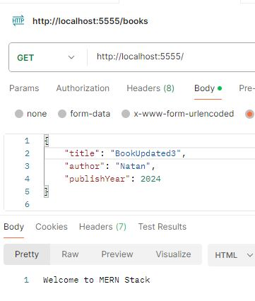


### 2. Add a New Book

- **Endpoint**: `POST /books`
- **Request Body**:
    ```json
    {
      "title": "Book Title",
      "author": "Author Name",
      "publishYear": 2024
    }
    ```
- **Response**: The newly created book object
- **Status Code**: 201 (Created)

   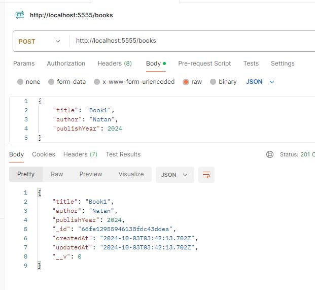

### 3. Get All Books

- **Endpoint**: `GET /books`
- **Response**:
    ```json
    {
      "count": number_of_books,
      "data": [list_of_books]
    }
    ```
- **Status Code**: 200 (OK)

   


### 4. Get a Book by ID

- **Endpoint**: `GET /books/:id`
- **Response**: The requested book object
- **Status Code**: 200 (OK) or 404 (Not Found)

   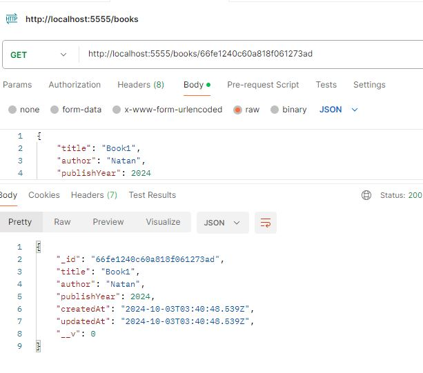

### 5. Update a Book by ID

- **Endpoint**: `PUT /books/:id`
- **Request Body**: (fields to update)
    ```json
    {
      "title": "Updated Title",
      "author": "Updated Author",
      "publishYear": 2025
    }
    ```
- **Response**: The updated book object
- **Status Code**: 200 (OK) or 404 (Not Found)

   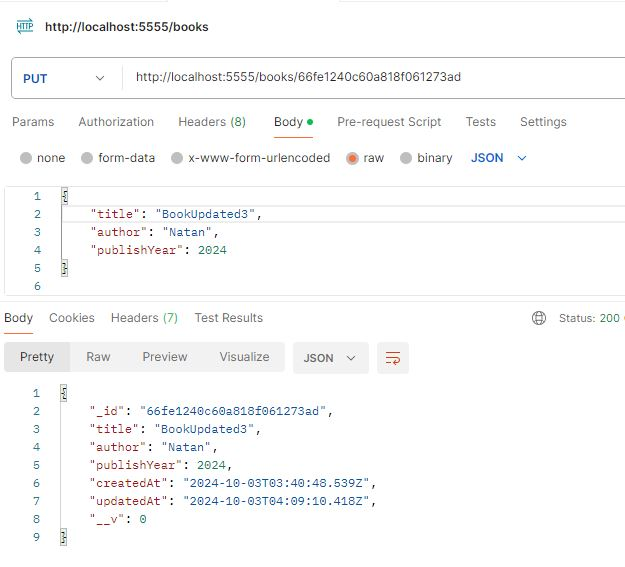

### 6. Delete a Book by ID

- **Endpoint**: `DELETE /books/:id`
- **Response**: The deleted book object
- **Status Code**: 200 (OK) or 404 (Not Found)
 
   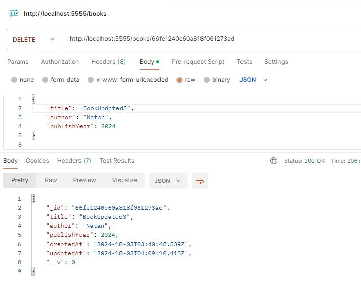
