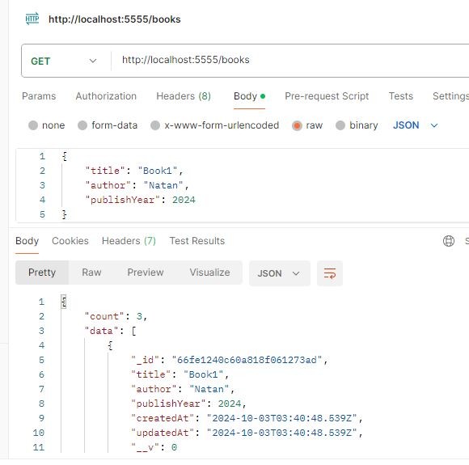

# Bookstore with MERN stack
This project is a **Bookstore Application** built using the **MERN (MongoDB, Express.js, React.js, Node.js)** stack. The backend provides RESTful API endpoints for managing books, including functionalities like adding, retrieving, updating, and deleting book records. The frontend can later be built using React.js to consume this API and display the data to users.


## Backend
# Bookstore API

This is a simple RESTful API built using Express.js and MongoDB for managing a collection of books. It provides endpoints to create, read, update, and delete book records.

## Features

- Add new books
- Fetch all books
- Fetch a single book by ID
- Update book details
- Delete a book by ID

## Prerequisites

Make sure you have the following installed on your machine:

- [Node.js](https://nodejs.org/)
- [MongoDB](https://www.mongodb.com/) (local instance or [MongoDB Atlas](https://www.mongodb.com/cloud/atlas))

## Installation

1. Clone the repository:
    ```bash
    git clone https://github.com/your-username/bookstore-api.git
    cd bookstore-api
    ```

2. Install the required dependencies:
    ```bash
    npm install
    ```

3. Set up the environment variables:
   - Create a `config.js` file in the root of the project and add the following:
     ```javascript
     export const PORT = 3000;
     export const mongoDBURL = "your-mongodb-connection-string";
     ```

4. Start the server:
    ```bash
    npm start
    ```

   The app will run at `http://localhost:3000`.

## API Endpoints

### 1. Get Welcome Message

- **Endpoint**: `GET /`
- **Response**: A welcome message
- **Status Code**: 234

   


### 2. Add a New Book

- **Endpoint**: `POST /books`
- **Request Body**:
    ```json
    {
      "title": "Book Title",
      "author": "Author Name",
      "publishYear": 2024
    }
    ```
- **Response**: The newly created book object
- **Status Code**: 201 (Created)

   

### 3. Get All Books

- **Endpoint**: `GET /books`
- **Response**:
    ```json
    {
      "count": number_of_books,
      "data": [list_of_books]
    }
    ```
- **Status Code**: 200 (OK)

   


### 4. Get a Book by ID

- **Endpoint**: `GET /books/:id`
- **Response**: The requested book object
- **Status Code**: 200 (OK) or 404 (Not Found)

   

### 5. Update a Book by ID

- **Endpoint**: `PUT /books/:id`
- **Request Body**: (fields to update)
    ```json
    {
      "title": "Updated Title",
      "author": "Updated Author",
      "publishYear": 2025
    }
    ```
- **Response**: The updated book object
- **Status Code**: 200 (OK) or 404 (Not Found)

   

### 6. Delete a Book by ID

- **Endpoint**: `DELETE /books/:id`
- **Response**: The deleted book object
- **Status Code**: 200 (OK) or 404 (Not Found)
 
   
